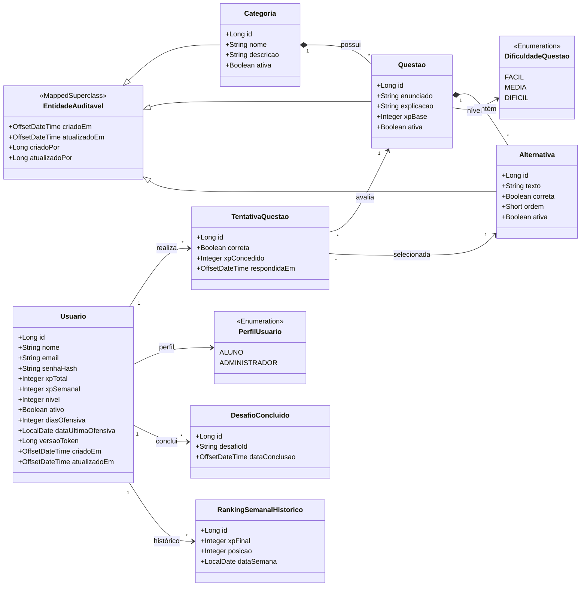

# Diagrama de Classes (Modelo de Domínio)

O diagrama abaixo ilustra o modelo de domínio principal (Entidades JPA) do backend do Cachly, demonstrando como os dados estão relacionados e persistidos no banco de dados.

## Notas da Arquitetura de Dados

- **EntidadeAuditavel**: Fornece de forma transparente rastreabilidade (quem criou/atualizou e quando) para entidades de gerenciamento de conteúdo (Categoria, Questão e Alternativa).
- **DesafioConcluido e TentativaQuestao**: Representam o histórico de aprendizagem e engajamento do aluno. A proteção transacional pessimista (Lock no `Usuario`) atua antes da inserção nessas tabelas para evitar inflacionamento de XP.
- **Exclusão Lógica**: Entidades core utilizam a propriedade `ativa` (Boolean) em vez de deleção física, preservando as integridades referenciais históricas.
